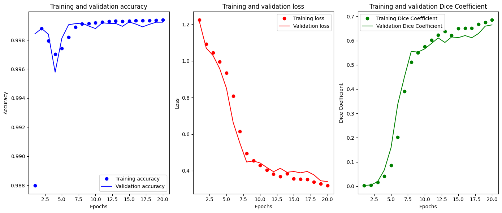

# winstars-ai-test-2024

# Important notes
- I did not launched .py files on local machine (especially train.py) (because afraid CPU will blow up)
- To get familiar with my work, check out  jupyter notebooks (/jupyter)
- For train.py you will need .npy files which are generated in jupyter notebook for training (ship-detection-tensorflow-u-net-dice-0-56.ipynb)

# Data preparation step
- Dataset contains images of ships (or no ships), shape 768 x 768 x 3. 
Too large for kaggle to keep descent amount of images in RAM, so resized it to 128 x 128 x 3
- Train and validation datasets contain 9000 and 1000 images respectively

# Training
- Loss: BCE + Dice_loss
- Other metrics observed: Accuracy, Dice_coefficient, Dice_loss
- Learning: 20 epochs, Adam(lr=0.0005)

# Results
0.65 dice-score on validation data

# My Kaggle notebooks
1. https://www.kaggle.com/code/artemzysko/ship-detection-tensorflow-u-net-dice-0-65
2. https://www.kaggle.com/code/artemzysko/ship-detection-model-inference
3. https://www.kaggle.com/code/artemzysko/airbus-ship-detection-simple-eda
